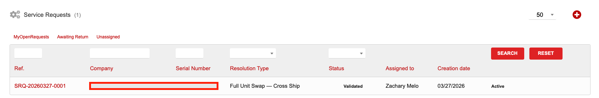
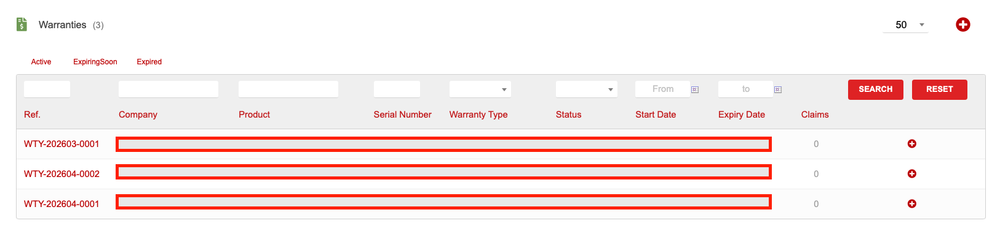
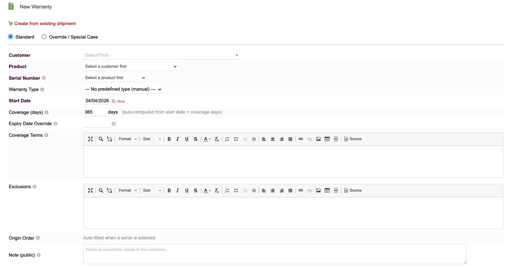
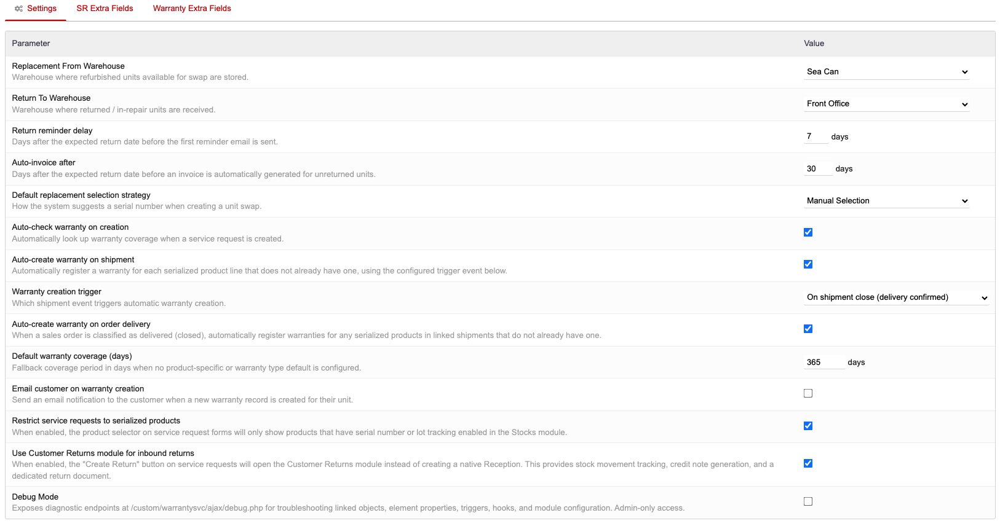

# WarrantySvc — Warranty & Service Management for Dolibarr

**Version 1.27.2** | [GitHub Repository](https://github.com/zacharymelo/Dolibarr-Warranties) | License: GPL-3.0

## Overview

WarrantySvc adds full RMA (Return Merchandise Authorization) and warranty management to Dolibarr for serialized equipment. Track warranties per serial number, manage service requests through a complete lifecycle, and generate PDF authorization slips -- all from within your existing Dolibarr installation.

## Features

### Service Requests

Create and manage service requests for warranted equipment. Each request follows a **6-stage lifecycle**:

1. **Draft** -- Initial creation, still editable
2. **Validated** -- Submitted for review
3. **In Progress** -- Actively being worked on
4. **Awaiting Return** -- Waiting for the customer to return equipment
5. **Resolved** -- Work complete, resolution recorded
6. **Closed** -- Finalized and archived

Each service request supports one of **7 resolution types**: Component Shipment, Component Shipment + Return, Full Unit Swap (Cross Ship), Full Unit Swap (Wait for Return), On-Site Service, Guidance Only, and Informational.

### Warranties

- **Per-serial warranties** -- Each serial number carries its own warranty record with start date, coverage duration, and expiry
- **Warranty types** -- Define custom warranty types (e.g., Standard 12-Month, Extended 24-Month, Limited 90-Day) with configurable default durations
- **Auto-warranty on shipment or order** -- Automatically create warranty records when shipments are validated or orders are confirmed
- **Extrafields support** -- Add custom fields to warranty records for your specific business needs

### PDF Authorization Slips

Generate printable PDF authorization slips from any service request. These include the RMA number, customer details, product and serial information, and authorization terms. Send them to customers as proof of RMA approval.

### Warranties Tab on Third-Party Cards

A dedicated "Warranties" tab appears on each customer's third-party card, showing all warranty records associated with that customer in one place.

## Requirements

| Requirement | Details |
|---|---|
| Dolibarr | Version 16 or higher |
| PHP | Version 7.0 or higher |
| **Required modules** | Third Parties, Products, Stock |
| **Optional modules** | Shipments, Orders, Projects, Customer Returns |

Enabling optional modules unlocks additional features such as auto-warranty creation on shipment and RMA-initiated returns.

## Installation

1. Download the latest `.zip` file from the [GitHub Releases](https://github.com/zacharymelo/Dolibarr-Warranties/releases) page
2. Log in to your Dolibarr instance as an administrator
3. Navigate to **Home > Setup > Modules/Applications**
4. Click the **Deploy external module** button at the top of the page
5. Upload the `.zip` file you downloaded
6. Once uploaded, find "WarrantySvc" in the module list and click the toggle to **enable** it
7. After enabling, click the gear icon to open the **Admin Setup** page and configure the module

## Configuration

After installation, go to the module's admin setup page to configure the following options:

- **Replacement Warehouse** -- The warehouse from which replacement units are shipped
- **Return Warehouse** -- The warehouse where returned items are received into stock
- **Return Reminder Delay** -- Number of days after the expected return date before a reminder is sent
- **Auto-Invoice After Days** -- Automatically generate an invoice if a return is not received within this many days
- **Replacement Strategy** -- Controls how the system selects replacement stock. Set to FIFO (First In, First Out) to ship the oldest units first
- **Auto-Check Warranty on Creation** -- Automatically verify warranty status when a new service request is created
- **Auto-Create Warranty on Shipment** -- Automatically generate a warranty record when a shipment is validated
- **Warranty Creation Trigger** -- Choose whether warranties are created on shipment validation, order validation, or manually only

## Usage Guide

### Creating Warranties

Warranties can be created in two modes:

- **Standard Mode** -- Select a warranty type and the system calculates the end date automatically based on the type's configured coverage duration
- **Override Mode** -- Manually set the start and end dates, overriding the warranty type's default duration. This is useful for negotiated or promotional warranties

To create a warranty manually, navigate to the Warranties menu, click "New Warranty," select the customer, product, serial number, and warranty type, then save.

### Managing Warranty Types

Go to the module's admin setup page to create and edit warranty types. Each type has a code, label, description, and default coverage duration in days. Examples: "Standard 12-Month," "Extended 24-Month," "Limited 90-Day."

### Creating Service Requests

1. Navigate to the Service Requests menu
2. Click "New Service Request"
3. Select the customer and the serial number -- the system will display the current warranty status
4. Choose a resolution type that matches the situation (e.g., Component Shipment, Full Unit Swap, On-Site Service)
5. Describe the issue and save the request as a Draft
6. Validate the request to begin the lifecycle

### Service Request Lifecycle

Use the status buttons on each service request card to advance it through the stages: Draft, Validated, In Progress, Awaiting Return, Resolved, and Closed. At the Resolved stage, record the resolution details and any internal notes.

### PDF Generation

On any validated or later-stage service request, click the "Generate PDF" button to create an authorization slip. This PDF can be downloaded or emailed to the customer as their RMA authorization document.

## Optional Integrations

### Customer Returns Module

When the [Customer Returns](https://github.com/zacharymelo/doli-returns) module is also installed and enabled, WarrantySvc can initiate inbound returns directly from service requests. This links the return process to the RMA workflow, allowing stock movements and credit notes to be handled through Customer Returns while maintaining full traceability back to the originating service request.

## Screenshots

**Service Requests List**

**Warranty List**

**New Warranty Form**

**Admin Setup**

## License

This module is licensed under the [GNU General Public License v3.0](https://www.gnu.org/licenses/gpl-3.0.html).
